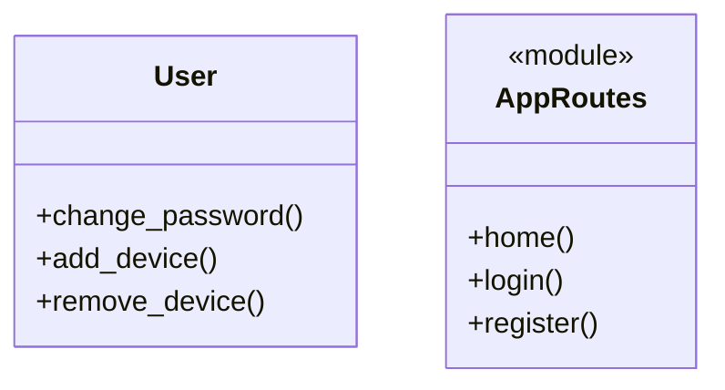

# Mermaid Class Diagram Generator

## Overview
This directory contains the script to automatically generate Mermaid class diagrams for the SmartDash Flask application.

## Files
- `generate_mermaid.py`: Python script that parses the application code and generates a Mermaid diagram

## How it Works
1. Uses Python's `ast` (Abstract Syntax Tree) library to parse Python files
2. Extracts class definitions with their methods
3. Extracts standalone functions
4. Groups standalone functions into pseudo-classes (modules):
   - `AppRoutes` - Flask route handlers from app.py
   - `SetupFunctions` - Setup utilities from setup.py
   - `DeviceSetupRoutes` - Device setup routes from device_setup/__init__.py
5. Generates Mermaid classDiagram syntax
6. Writes output to `docs/diagram.mmd`

## Usage

### Run Manually
Run the script manually from the command line:
```bash
python scripts/generate_mermaid.py
```

### Run via GitHub Actions
The workflow runs automatically when Python files are pushed to the master branch.

#### Trigger Manually from GitHub UI
After merging the PR, you can manually trigger the workflow:

1. Go to your repository on GitHub
2. Click on the "Actions" tab
3. Select "Update Mermaid Diagram" from the left sidebar
4. Click the "Run workflow" button on the right
5. Select the branch (usually `master`)
6. Click "Run workflow"

The workflow will execute and automatically commit the updated diagram if there are changes.

## Output
The generated `docs/diagram.mmd` file can be:
- Rendered in GitHub's markdown files
- Viewed in any Mermaid-compatible tool
- Embedded in documentation

## Example Output

